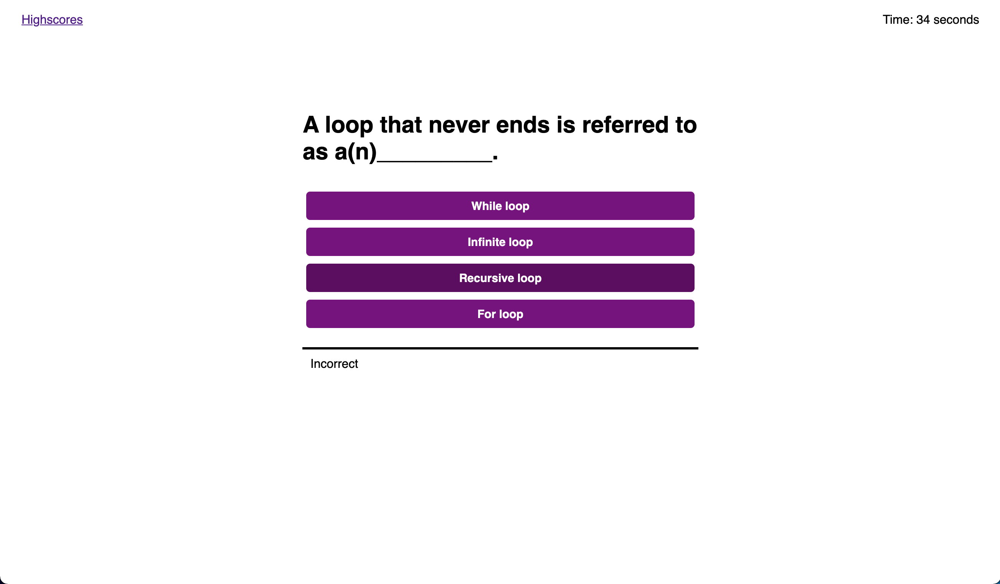
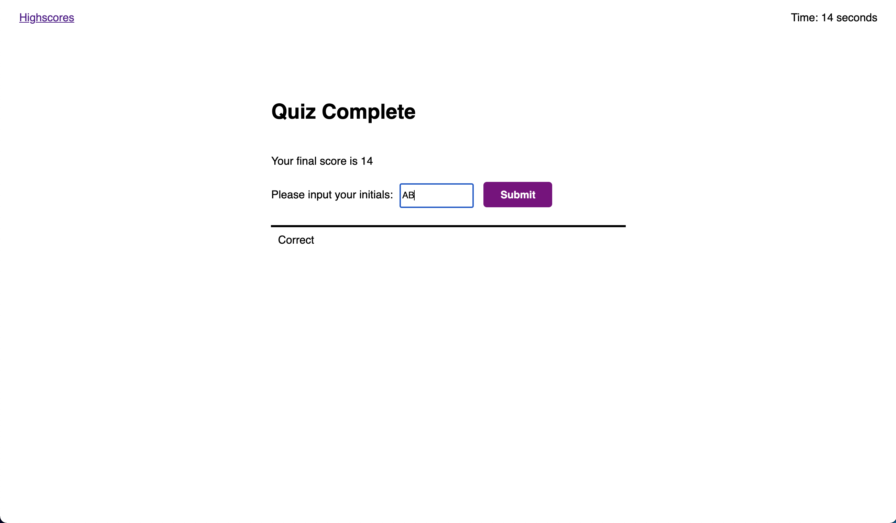
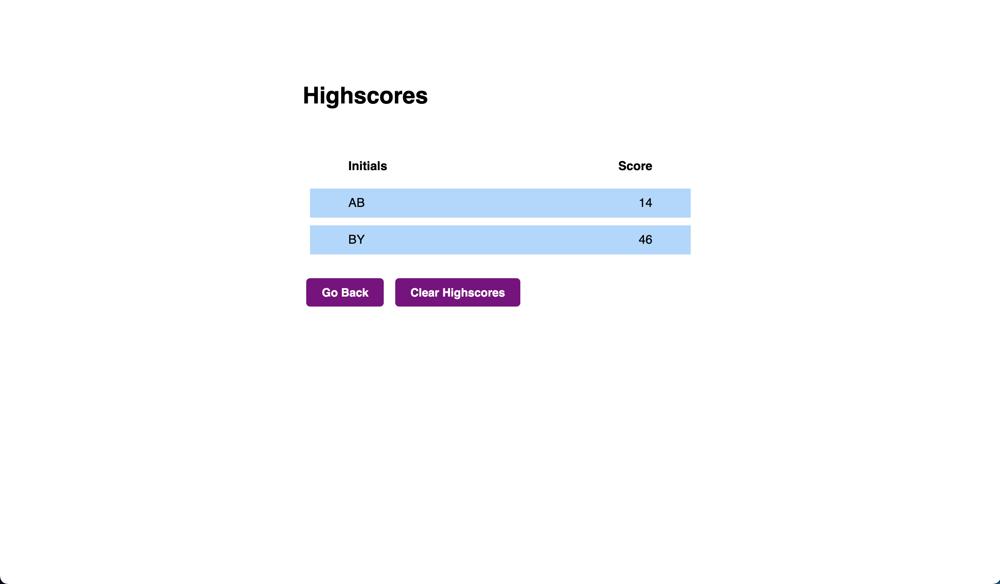

# Coding Quiz

## Description
A coding quiz similar to one that may be given during a coding-based job interview. The quiz consists of 5 multiple-choice questions and is timed. When a question is anwered incorrectly, 10 seconds is removed from the timer. At the end of the quiz, the final score is equivilant to the total time left. An input box will appear at the end for identifying initials. Up to 5 scores displaying both the final score and the player's initials are able to be saved for comparison at any time. To save more scores, clear the scoreboard and start over. 

## Screenshots

## Link to Application
[Coding Quiz](https://ethanc29.github.io/Coding-Quiz/)